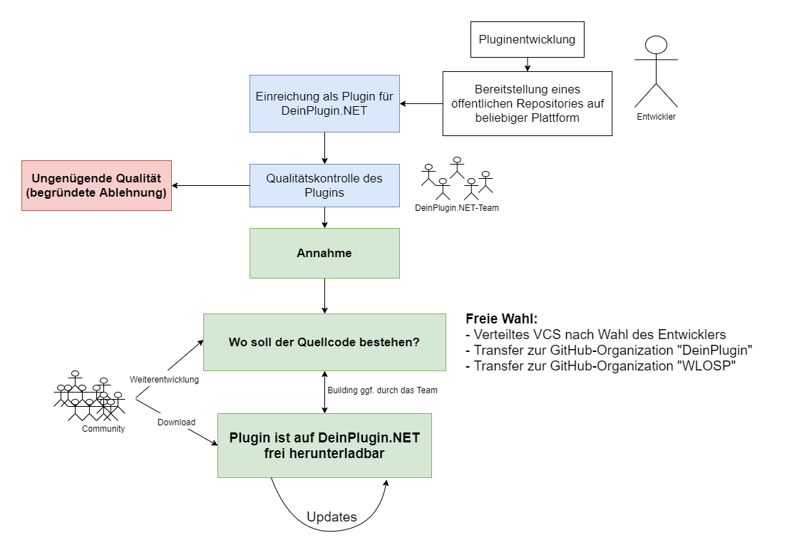

# Workflow zum Mitarbeiten

## Visualisierung des Verfahrens

Zur Übersicht über den Werdegang eines Projekts bis hin zur Publizierung auf [DeinPlugin.NET](https://deinplugin.net) und/oder der Veröffentlichung unter dieser Organisation soll das folgende Diagramm dienen. Alle Detailaspekte sind im Folgenden gesondert erläutert.

## Beschreibung des Verfahrens

### Pluginentwicklung

An erster Stelle steht natürlich der wohl bedeutsamste Schritt: Die Entwicklung des Projekts. Eine zuvorgegangene Planung der Projektidee wird vorausgesetzt. Wie im [Startguide](./README.md) erläutert, sind dem Entwickler viele Freiheiten gegeben. Dennoch legen wir ebenso viel Wert auf die Einhaltung der gegebenen Richtlinien.

### Bereitstellung des Repositories

Damit der Quellcode auf seine Eignung und Qualität geprüft werden kann, ist ein öffentliches Repository notwendig. Die dabei verwendete Plattform steht dem Entwickler (bzw. den Entwicklern) frei.

### Einreichung als Plugin für DeinPlugin.NET

Wenn die Vorschritte erfüllt wurden, kannst Du dein Plugin für die Nutzung auf DeinPlugin.NET einreichen. Bitte gib davor Acht, dass du alle Punkte der Richtlinie einhältst, die dafür gefordert sind. Die Einreichung selbst wird durch eine noch nicht verfügbare Seite auf [DeinPlugin.NET](https://deinplugin.net) möglich sein.

### Qualitätskontrolle

Ausgewählte Teammitglieder der Plattform prüfen dein Plugin auf seine Gültigkeit gegenüber aller Kriterien. Sollten grobe Verstöße gegen unsere Richtlinien vorliegen oder die Qualität nicht unseren Ansprüchen genügen, wird das Plugin nicht für unsere Plattform zugelassen.
In jedem anderen Fall benachrichtigen wir dich *möglichst* zeitnah über eine Annahme.

### Weitere Verwaltung des Quellcodes

Jedem Entwickler steht nach der Annahme frei, wo das Plugin bestehen soll. Dafür bieten wir 3 generelle Wege:

- Weiterhin die Verwaltung über ein gesondertes Repository auf einer beliebigen Plattform. 

- Ein Transfer zur [WeLoveOpenSourcePlugins GitHub-Organisation](https://github.com/WeLoveOpenSourcePlugins).

- Ein Transfer zur offiziellen [DeinPlugin.NET GitHub-Organisation](https://github.com/DeinPlugin).

Nach der entsprechenden Wahl wird das Repository (je nach Entscheidung) transferiert. Das nun bestehende Repository ist die Open-Source-Referenz, die auch auf der DeinPlugin.NET Plattform anzufinden sein wird.

### Veröffentlichung

Das Plugin wird, nachdem es durch das Team oder ein automatisiertes Tool gebuildet wurde, auf der Plattform bereitgestellt. Zusätzlich wird eine Übersicht über die Features oder die Wirkungsweise des Plugins gegeben (ggf. einschließlich von Screenshots und Tutorials). Ebenso ist eine Verlinkung zum Entsprechenden Repository vorhanden.

### Updates

Das bestehende Plugin kann von der Community und/oder den ursprünglichen Entwicklern geupdatet werden. Dazu stehen die üblichen Tools eines Versionskontrollsystems zur Verfügung.